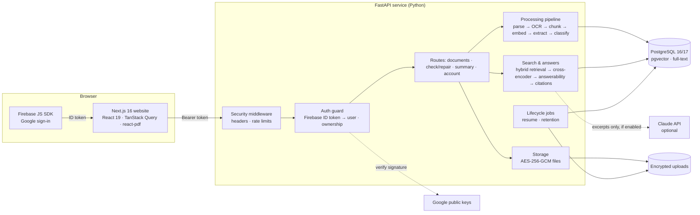

# Architecture

ClauseLens is a modular monolith: one Next.js website, one FastAPI service, one PostgreSQL
database with pgvector. All AI models run inside the API process on CPU — no data leaves the
server unless the optional Claude provider is switched on.



## Request path

1. The browser signs in with Google through Firebase and receives an ID token (1 hour, refreshed
   automatically).
2. Every API call carries `Authorization: Bearer <token>`. The security middleware adds headers
   and applies rate limits; the auth guard verifies the token's signature against Google's
   cached public keys, checks issuer, audience, expiry, that the sign-in was Google and the email
   verified, and loads (or creates) the user.
3. For any `/documents/{id}…` route, a router-level guard checks ownership. Another user's
   document answers **404**, so its existence is not revealed.
4. The route reads or writes through services; files only through `storage`, which encrypts and
   decrypts transparently.

## Processing pipeline (`services/processing.py`)

Runs in the background after upload; the website polls the status.

| Step | Module | What happens |
|---|---|---|
| Read | `parsing/pdf.py` | PyMuPDF text in reading order; diagonal watermarks/stamps removed |
| OCR | `parsing/ocr.py` | Pages without a text layer are rendered at 200 dpi and read with RapidOCR (PP-OCR, ONNX) |
| Structure | `chunking.py` | Clauses and sections (contracts: `12.1`, `(a)`; statutes: `12. Title.—(1) …`, chapters); table of contents, amendment footnotes, schedules kept apart |
| Meaning | `embeddings.py` | bge-small-en-v1.5 (384-d) vectors per chunk, stored in pgvector |
| Facts | `extraction.py` | 44 legal concepts (notice period, deadlines, penalties, money …) with confidence and normalised values |
| Type | `classification.py` | Rule-based classifier over the taxonomy (178 document types), with confidence and reasons |

If the server restarts mid-way, `lifecycle.resume_unfinished` processes the document again at
start-up.

## Answering a question (`services/qa.py`)

```text
question
  → typo correction with the document's own words
  → glossary: everyday words → legal wording ("builder" → "promoter")
  → hybrid retrieval: pgvector cosine ∪ PostgreSQL full-text ∪ named clause ("Section 7")
  → fused score (meaning + keywords + concept/fact evidence + headings + structure)
  → cross-encoder re-ranking of the top 12 (MiniLM-L-6, question + legal wording)
  → answerability: subject words present in the document? best passage relevant enough?
      no  → "I couldn't find enough information in the uploaded document."
      yes → extractive answer (quote or extracted value) with page + clause citations
            (or Claude, given only the retrieved excerpts; uncited claims are dropped)
```

Details and measurements: [AI_Pipeline.md](AI_Pipeline.md), [Evaluation.md](Evaluation.md).

## Security layers

Google sign-in (verified server-side) · per-document ownership (404 for others) · AES-256-GCM
encryption at rest · rate limits · security headers · audit log · user-visible activity and
"delete all my data" · optional retention · production start-up refuses insecure settings.
See [Security.md](Security.md).

## Scaling

| Part | Today | Scaling path |
|---|---|---|
| API | Stateless except in-memory rate-limit counters and small caches | Run N replicas behind a load balancer; move rate-limit counters to Redis |
| AI models | In-process, CPU (~0.4 GB RAM per worker) | More workers/replicas; a GPU or a separate model service if needed |
| Processing | Background task in the API process | A job queue (e.g. RQ/Celery on Redis) with dedicated workers |
| Database | One PostgreSQL | Managed PostgreSQL with pgvector; read replicas; HNSW vector index for very large collections |
| Files | Local volume (encrypted) | Object storage (S3/GCS) behind the same `storage` interface |

Measured throughput and latency: [Evaluation.md § Performance](Evaluation.md#performance).
