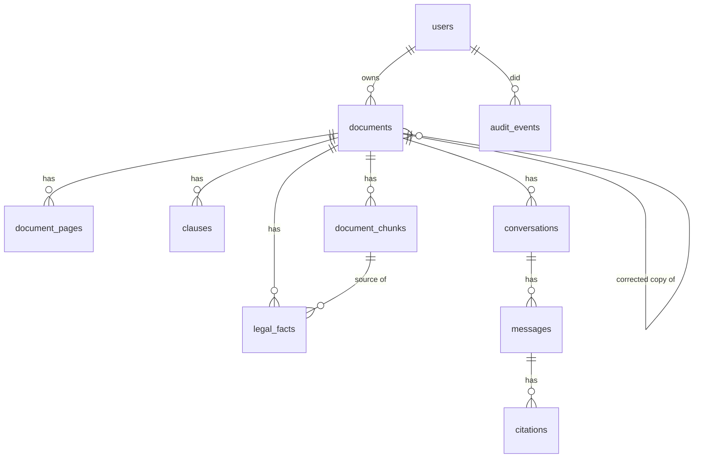

# Database

PostgreSQL 16/17 with the `vector` extension (pgvector). Schema changes are Alembic migrations in
`backend/migrations/versions` (`uv run alembic upgrade head`). Models: `backend/app/models`.

| Table | Purpose | Key columns / indexes |
|---|---|---|
| `users` | A Google account (Firebase) | `firebase_uid` unique, `email` unique |
| `documents` | An uploaded file and its processing state | `user_id` (owner), `status`, `document_type_id`, `classification` (JSONB, with confidence and reasons), `source_document_id` (corrected copies), `changes` |
| `document_pages` | Page text in reading order (OCR text for scanned pages) | `(document_id, page_number)` |
| `clauses` | Sections/clauses with reference and heading | `(document_id, page_number)` |
| `document_chunks` | Retrieval units | `embedding vector(384)` (pgvector), `search_vector tsvector` generated from heading (weight A) + text (B) with a **GIN** index |
| `legal_facts` | Extracted facts (notice period, deadline, penalty …) | `concept` index, `confidence`, `normalized_value` (JSONB), `source_text` |
| `conversations`, `messages`, `citations` | Q&A history with the sources of every answer | |
| `audit_events` | Who did what to which document, when | `(user_id, created_at)`; `document_id` is not a foreign key so deletions stay on record |

## Data protection

- Deleting a document cascades to all derived rows; its encrypted file is removed.
- Deleting all of a user's documents (`DELETE /account/documents`) is recorded in `audit_events`.
- Uploaded files are not in the database; they are AES-256-GCM encrypted on disk
  (`FILE_ENCRYPTION_KEY`), so neither a database dump nor the uploads folder alone reveals a
  document's file.
- In production the database is reachable only from the API container
  (`docker-compose.prod.yml`), with a generated password.
